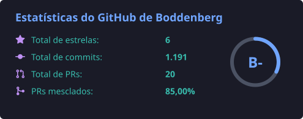
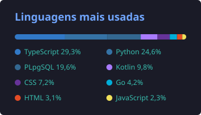
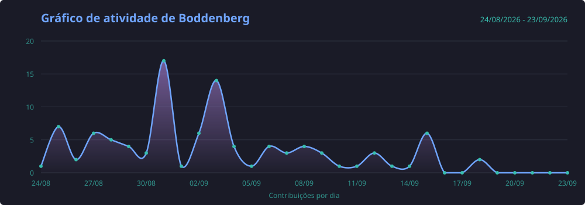

  
# Filipe Boddenberg 

### Engenheiro de IA no Itaú • Kotlin • IA • Tecnologia

Nos projetos pessoais, gosto de explorar ideias criativas com dados e inteligência artificial.

  
  
  

  

---

### Linguagens e Fundamentos

### Cloud, Infra e Ferramentas

  
### Inteligência Artificial

 

 

---

# Tocando agora

---

# Certificações

---

# Aprendizado Contínuo

---

# GitHub Stats

---

# Activity

